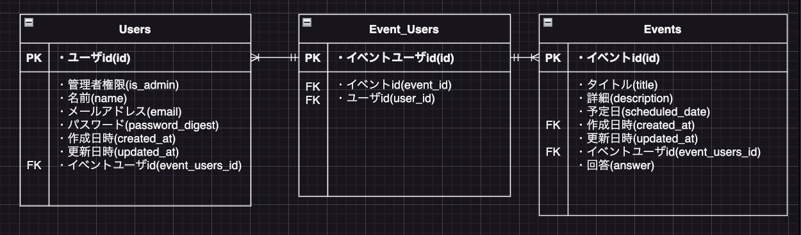
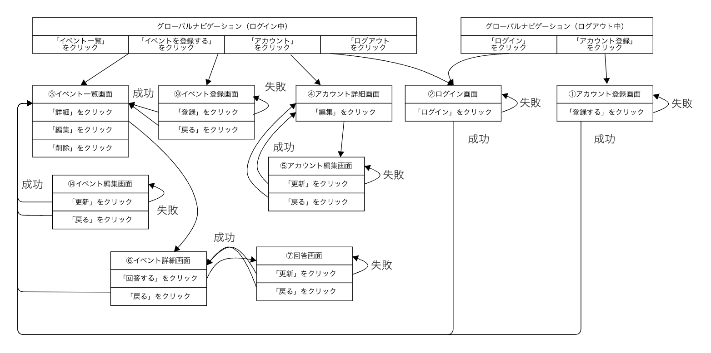

# README

This README would normally document whatever steps are necessary to get the
application up and running.

Things you may want to cover:

* Ruby version
- Ruby: 3.3.0
- Rails: 6.1.7.6

* System dependencies

* Configuration

* Database creation

* Database initialization

* How to run the test suite

* アプリケーションの実行手順
  % git clone git@github.com:yusuke-727/for_original_app.git
  % cd for_original_app
  % bundle install
  % rails db:create
  % rails db:migrate
  % rails s

  ブラウザで以下のURLにアクセスしてください：
  http://localhost:3000

* Services (job queues, cache servers, search engines, etc.)

* Deployment instructions

* カタログ設計、テーブル定義書の共有リンク
  https://docs.google.com/spreadsheets/d/1LeZQWF8jZyCMKrrp4xBm3D3zKoprHD3h_SLkJdzcWp8/edit?usp=sharing

* ワイヤーフレームの共有リンク
  https://docs.google.com/spreadsheets/d/1LeZQWF8jZyCMKrrp4xBm3D3zKoprHD3h_SLkJdzcWp8/edit?usp=sharing

* ER図

* 画面遷移図

* 画面遷移図の共有リンク
  https://cacoo.com/diagrams/Gy5HULk0HUHmcd4O/94880
